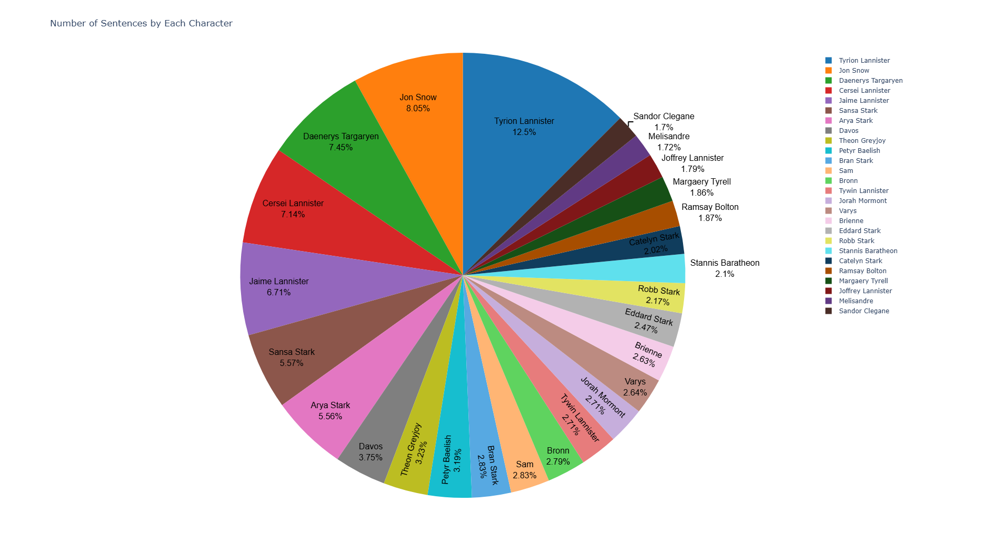
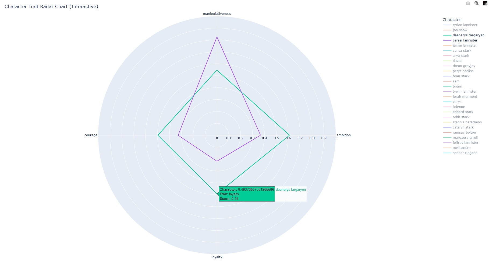
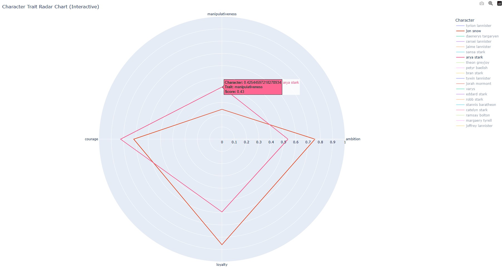
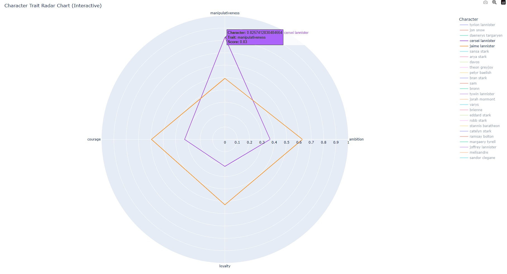

# PersonaProfiler: AI-Powered Character Analysis

PersonaProfiler is an advanced AI-powered tool designed to extract personality traits from character dialogues and match user personalities with iconic characters. Using state-of-the-art Natural Language Processing (NLP) models, the project offers seamless character analysis and personality mapping.

## Features
- **Dialogue Analysis**: Extract personality traits like humor, empathy, ambition, quirkiness, and romanticism from large datasets.
- **Batch Processing**: Efficient handling of large datasets using optimized sentiment analysis and zero-shot classification pipelines.
- **Personality Matching**: Compare user inputs to character profiles to find the closest personality match.
- **Scalable Design**: Capable of analyzing 200K+ records while maintaining performance efficiency.

## Dataset
This project uses the *Game of Thrones Script (All Seasons)* dataset from Kaggle. The dataset contains dialogues from all seasons of the series and serves as the foundation for personality analysis.

## Technologies Used
- **Programming Languages**: Python
- **Libraries & Tools**:
  - Hugging Face Transformers
  - Pandas
  - Torch
  - Scipy
- **Models**: Sentiment Analysis and Zero-Shot Classification from Hugging Face

## How It Works
1. **Data Processing**: Cleans and preprocesses dialogue data from the dataset.
2. **Trait Extraction**:
   - *Humor*: Analyzes sentiment and identifies humorous keywords.
   - *Empathy*: Counts occurrences of empathy-related keywords.
   - *Other Traits*: Leverages zero-shot classification to determine quirkiness, ambition, and romanticism.
3. **Normalization**: Normalizes trait scores for accurate comparison across characters.
4. **Personality Matching**: Matches user traits with character profiles using cosine similarity.

## Usage

### Clone the Repository
git clone https://github.com/yourusername/PersonaProfiler.git
cd PersonaProfiler

### Install Dependencies
Ensure Python 3.7+ is installed, then run:

## Results

- Character personality profiles are saved in a JSON file (`char_profiles.json`).
- Normalized profiles ensure consistent and comparable trait scores.
- User personality inputs are matched with the closest character profile.

### Dialogue Proportion by Characters
Below is a pie chart illustrating the proportion of dialogues by different characters in the dataset:

### Accuracy Comparison with Character Profiles
The following images compare user personality inputs with iconic Game of Thrones characters to demonstrate accuracy:

1. Cercei vs Danaerys
   
     

3. Arya vs Jon
   
     

4. Cercei vs Jaime

    

For more comparisions visit: https://got-character-comparision.netlify.app/

These visualizations highlight how closely user traits align with specific character profiles.

## Contributing
Contributions are welcome! Feel free to fork this repository and submit pull requests with enhancements or fixes.

